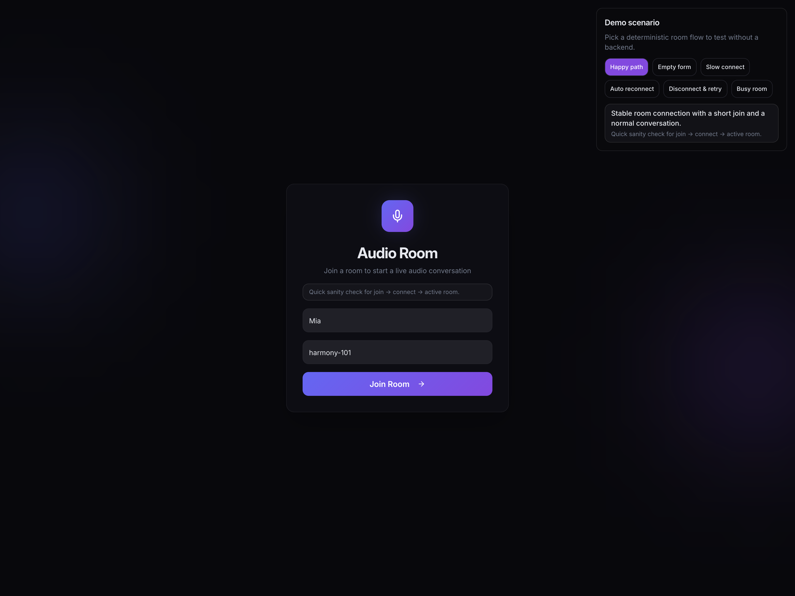
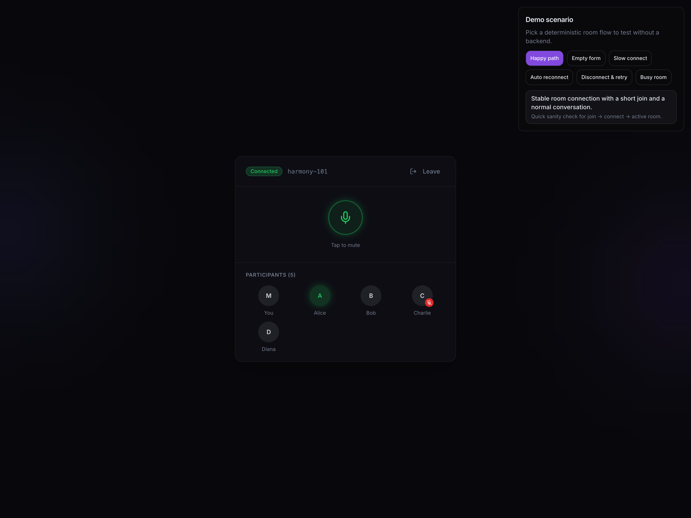
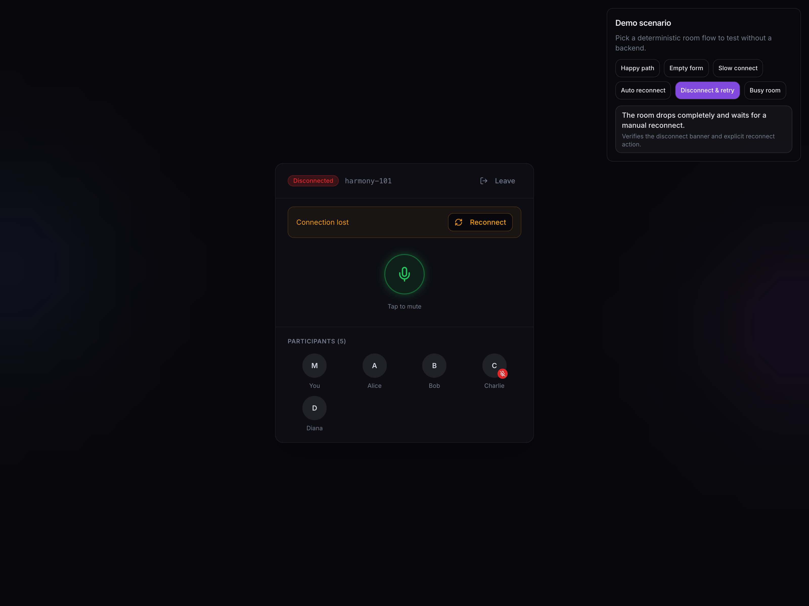
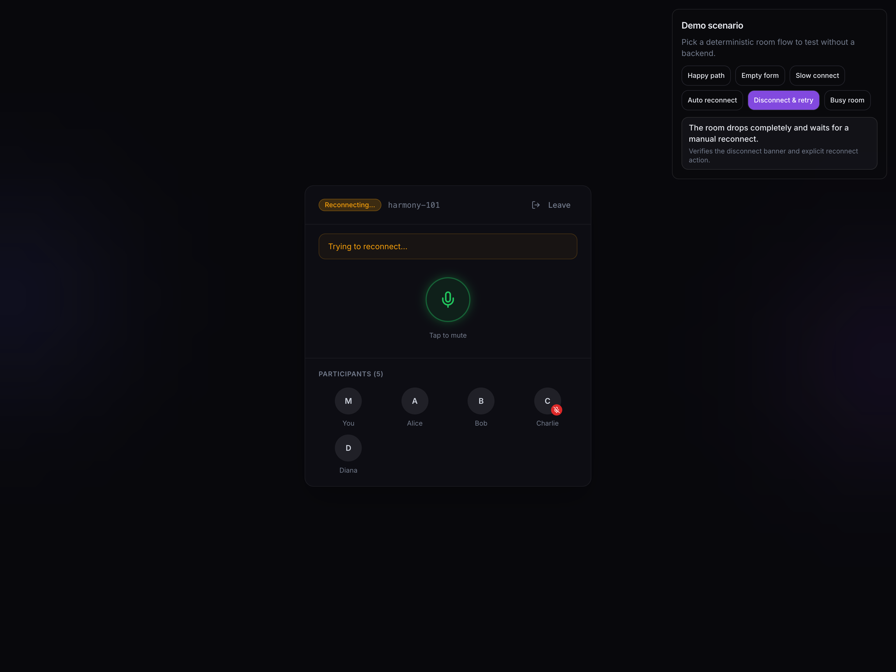
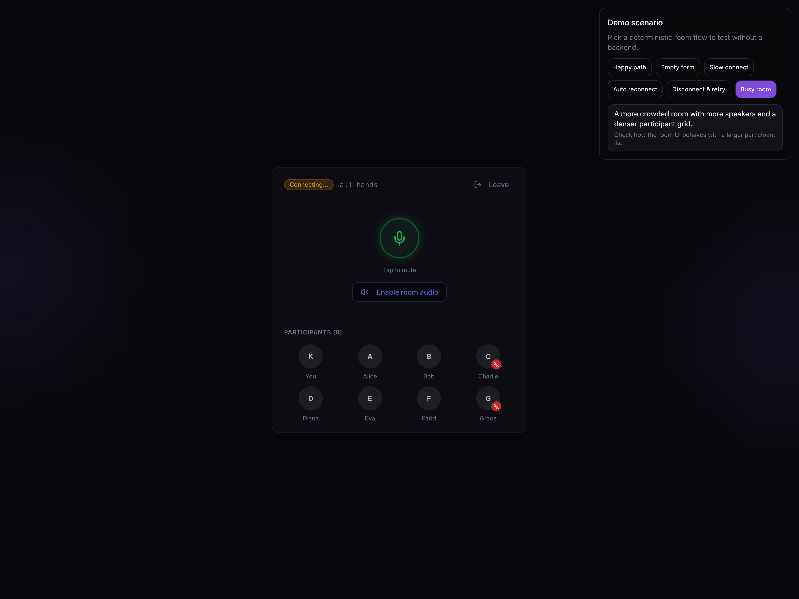

# Harmony Rooms

Премиальный demo-интерфейс аудиокомнаты на React + TypeScript с детерминированными mock-сценариями, которые позволяют пройти весь UX-флоу без бэкенда.



## Обзор

`Harmony Rooms` — это фронтенд-прототип live audio room, в котором можно локально проверить ключевые сценарии подключения, поведения комнаты и восстановления соединения.

Проект ориентирован на быстрый просмотр UX и ручное тестирование:
- вход в комнату через join-экран
- переключение demo-сценариев прямо в интерфейсе
- состояния `connecting`, `connected`, `reconnecting`, `disconnected`
- crowded room / busy room без реального бэкенда
- воспроизводимые сценарии для ручной проверки и тестов

## Что умеет приложение

- **Join flow** — вход в комнату по имени и room id
- **Scenario switcher** — быстрый выбор mock-сценария в UI
- **Deterministic room playback** — сценарии воспроизводятся предсказуемо, без случайного поведения
- **Connection recovery states** — можно проверить reconnect и disconnect UX
- **Busy room preview** — UI комнаты с большим числом участников
- **Тесты** — сценарная логика и page flow покрыты Vitest-тестами

## Демо-сценарии

| Сценарий | Что показывает | Когда использовать |
| --- | --- | --- |
| `Happy path` | Базовый успешный вход и стабильную комнату | Быстрый smoke-check интерфейса |
| `Empty form` | Ошибки валидации на пустой форме | Проверка join-валидации |
| `Slow connect` | Долгое подключение и отключённый room audio | Проверка loading/await states |
| `Auto reconnect` | Автоматическое восстановление соединения | Проверка passive reconnect UX |
| `Disconnect & retry` | Потерю соединения и ручной reconnect | Проверка баннера и reconnect CTA |
| `Busy room` | Комнату с большим числом участников | Проверка плотного participant grid |

## Скриншоты

### Экран входа


### Стабильная подключённая комната



### Потеря соединения



### Восстановление соединения



### Комната с большим количеством участников



## Быстрый старт

### Требования

- Node.js 22+
- npm 10+

### Установка

```bash
npm install
```

### Запуск локально

```bash
npm run dev
```

После запуска открой адрес, который покажет Vite в терминале.

### Как проверить demo flow

1. Открой приложение в браузере.
2. В правом верхнем углу выбери нужный сценарий.
3. При необходимости отредактируй имя и `Room ID`.
4. Нажми **Join Room**.
5. Пройди нужный UX-флоу: подключение, reconnect, disconnect или busy room.

## Тесты

Запуск всех тестов:

```bash
npm test
```

Сейчас тесты покрывают:
- детерминированное воспроизведение шагов сценария
- reconnect flow
- mute-поведение локального участника
- page-level join / leave flow
- join validation для пустой формы

## Структура проекта

```text
src/
  components/
    JoinForm.tsx
    RoomPanel.tsx
    ScenarioSwitcher.tsx
  hooks/
    useMockRoomSession.ts
    useMockRoomSession.test.tsx
  lib/
    mockRoomScenarios.ts
  pages/
    Index.tsx
    Index.test.tsx
```

Ключевые файлы:
- `src/pages/Index.tsx` — orchestration страницы и переключение сценариев
- `src/components/ScenarioSwitcher.tsx` — UI выбора demo-сценария
- `src/components/JoinForm.tsx` — форма входа в комнату
- `src/components/RoomPanel.tsx` — презентационный UI комнаты
- `src/hooks/useMockRoomSession.ts` — детерминированный playback сценариев
- `src/lib/mockRoomScenarios.ts` — данные и описание mock-сценариев

## Стек

- **React 18**
- **TypeScript**
- **Vite**
- **Tailwind CSS**
- **shadcn/ui + Radix UI**
- **Vitest + Testing Library**

## Для чего этот проект удобен

Этот репозиторий полезен, если нужно:
- быстро показать UI аудиокомнаты без API
- проверить UX состояний соединения
- сделать demo для дизайна, QA или product review
- развивать сценарии комнаты до появления реального бэкенда
